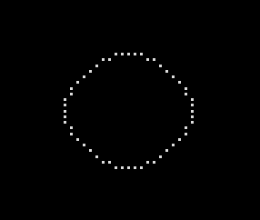
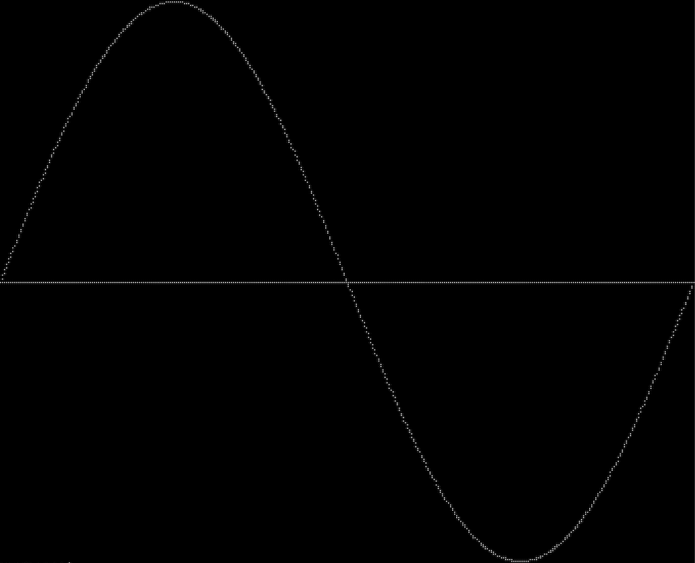
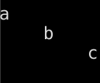
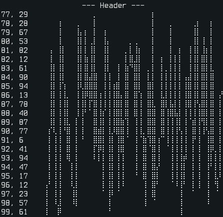
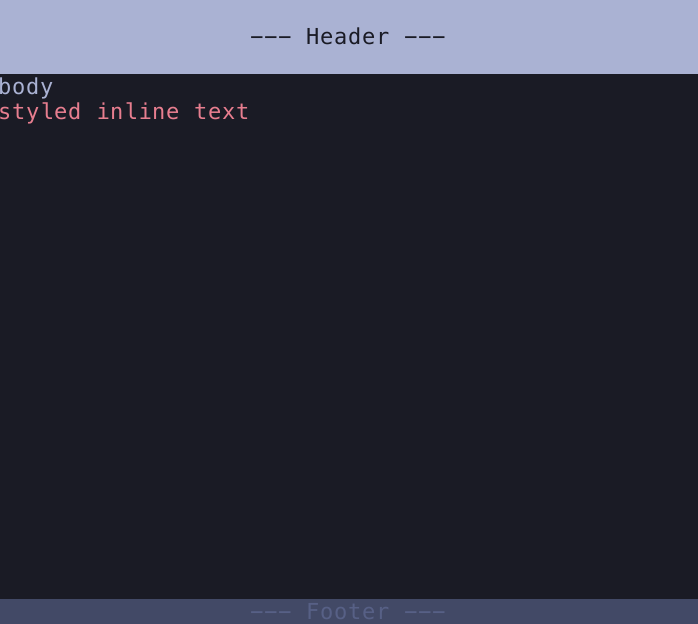

Python TUI Library
==================

A minimal Python library for text user-interfaces, inspired by but not based on ncurses.

### Features
- Minimal, no non-default dependencies.
- 24-bit colors.
- Basic windows with support for scrolling and styling.
- Vim inspired window splitting for more advanced layouts.
- Braille code based "canvas" and plotting.
- Non-blocking keyboard input on Linux (sort of.)

### Why?
I'm comfortable with ncurses, but needed 24-bit colors. While it's possible to achieve that in ncurses, the result is a mess. There are no shortages of other TUI libraries (blessed, Urwid, Textualize, pytermgui, etc), but they tend do to a lot more than I wanted (borders, window management, widget libaries, etc). Some are also based on ncurses and inherit the same color limitations.

For braille plotting I originally considered [plotille](https://github.com/tammoippen/plotille), but I wanted more control over styling (ex. disable axis and labels.)

The braille canvas was originally [drawille](https://github.com/asciimoo/drawille), but I was having performance issues with animations. This implementation performed much better for me.

In the end, I thought the answers to my problems could be wrapped up in a single, fairly straight forward file.

### Compatibility:
No attempts made at achieving ncurses-level compatibility, but it should work on any modern terminal emulator.

Tested on foot, alacritty and kitty.

### Install:
Download/clone `pytui.py` and import.

### Usage:
Most of the documentation is in the code itself. Try `help()` or `pydoc`.

### Examples:

#### Canvas
```
from pytui import Canvas


# bresenham's circle
def octant(canvas: Canvas, cx: int, cy: int, x: int, y: int) -> None:
    canvas.set(cx+x, cy+y)
    canvas.set(cx-x, cy+y)
    canvas.set(cx+x, cy-y)
    canvas.set(cx-x, cy-y)
    canvas.set(cx+y, cy+x)
    canvas.set(cx-y, cy+x)
    canvas.set(cx+y, cy-x)
    canvas.set(cx-y, cy-x)


def circle(canvas: Canvas, cx: int, cy: int, r: int) -> None:
    x = 0
    y = r
    d = 3 - 2 * r

    octant(canvas, cx, cy, x, y)

    while y >= x:
        x += 1
        if d > 0:
            y -= 1
            d = d + 4 * (x - y) + 10
        else:
            d = d + 4 * x + 6
        octant(canvas, cx, cy, x, y)


# characters are taller than wide
canvas = Canvas(20, 10)

# draw circle at center
circle(canvas, canvas.width // 2, canvas.height // 2, 10)

print(canvas.draw())
```


#### Plot
```
from pytui import Plot
from math import pi, sin


# create a plot from 0,-1 to 2*pi,1 to capture one full sine wave
plot = Plot(40, 10, 0, -1, 2*pi, 1)

# draw X-axis
plot.line(0, 0, 2*pi, 0)

# draw sine wave
x = 0.0
step = 0.1
while x < 2*pi:
    plot.point(x, sin(x))
    x += step

print(plot.draw())
```


#### Terminal
Like above, but fullscreen with terminal reset after.
```
from pytui import Terminal, Plot
from math import pi, sin


terminal = Terminal()
terminal.fullscreen()

plot = Plot(terminal.get_columns(), terminal.get_lines()-1, 0, -1, 2*pi, 1)

# draw X-axis
plot.line(0, 0, 2*pi, 0)

# draw sine wave
x = 0.0
step = 0.01
while x < 2*pi:
    plot.point(x, sin(x))
    x += step

print(plot.draw())

terminal.reset()
```


#### Simple Window
```
from pytui import Window


# create a window at the top left, append lines with different justifications
window = Window(0, 0, 9, 3)
window.append_line('a')
window.append_line('b', 'center')
window.append_line('c', 'right')
window.draw()
```


#### Split Windows
```
from pytui import Window, Plot
from random import randrange


# create an initial "screen" to sub-divide
screen = Window(0, 0, 50, 25)

# horizontally split into 1 line tall header and footer with remainder for body
(header, body, footer) = screen.hsplit(1, None, 1)

# vertically split body into 20% left and 80% right
(left, right) = body.vsplit(0.2)

# add some header/footer text
header.append_line('--- Header ---', 'center')
footer.append_line('--- Footer ---', 'center')

# create a random plot, show points left and plot right
plot = Plot(right.width, right.height, 0, 0, 100, 100)
(px, py) = (0, 0)
for x in range(100):
    y = randrange(int(plot.miny), int(plot.maxy))
    plot.line(px, py, x, y)
    (px, py) = (x, y)
    left.append_line(f'{x}, {y}')

right.update_content(plot.draw())

# draw all final windows
for window in (header, footer, left, right):
    window.draw()
```


#### Styled Windows
```
from pytui import StyledWindow, Text


# create an initial "screen" to sub-divide
# windows split from this inherit the same style
screen = StyledWindow(0, 0, 50, 25, {'fg': (0xa9b1d6), 'bg': (0x1a1b26)})

# horizontally split into header and footer with remainder for body
(header, body, footer) = screen.hsplit(3, None, 1)

# re-style header and footer
header.update_style({'bg': (0xa9b1d6), 'fg': (0x1a1b26)})
footer.update_style({'fg': (0x565f89), 'bg': (0x414868)})

# add some text
header.append_line('')
header.append_line('--- Header ---', 'center')
footer.append_line('--- Footer ---', 'center')

body.append_line('body')
body.append_line(
    Text('styled inline text').style({'fg': (0xf7768e), 'bg': (0x1a1b26)})
)

# draw all final windows
for window in (header, footer, body):
    window.draw()
```


#### Keyboard

Simulates non-blocking keyboard input on Linux using Python threads.

There is probably a better way to do this, please let me know if I missed something.

The example below loops endlessly until `q` terminates it, and prints any other key.

The shutdown function ensures line buffering is restored on exit.

```
import signal
import os
from time import sleep
from pytui import Keyboard, shutdown


def listener(c: str) -> None:
    if c == 'q':
        print('quiting')
        # exit() will just end the thread, kill whole process, interrupt sleep
        os.kill(os.getpid(), signal.SIGINT)
    else:
        print(f'{c} - press q to quit')


keyboard = Keyboard()

# ensure ctrl+c restores terminal state before messing with it
signal.signal(signal.SIGINT, lambda signal, frame: shutdown())

# attach our listener
keyboard.listen(listener)

# do something until 'q' interrupts
while True:
    sleep(1)

shutdown()
```
