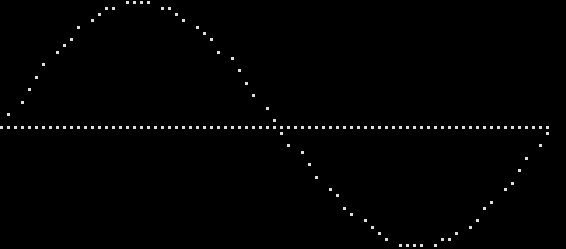
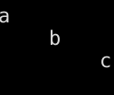
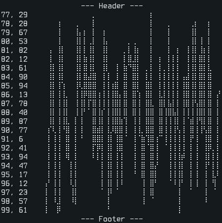

Python TUI Library
==================

A minimal Python library for text user-interfaces, inspired by but not based on ncurses.

### Features
- Minimal, no non-default dependencies.
- 24-bit colors.
- Basic windows with support for scrolling and styling.
- Vim inspired window splitting for more advanced layouts.
- Braille code based "canvas" and plotting.
- Non-blocking keyboard input on Linux (sort of.)

### Why?
I'm comfortable with ncurses, but needed 24-bit colors (for [sigkit](https://github.com/smar10s/sigkit)). While it's possible to achieve that in ncurses, the result is a mess. There are no shortages of other TUI libraries (blessed, Urwid, Textualize, pytermgui, etc), but they tend do to a lot more than I wanted (borders, window management, widget libaries, etc). Some are also based on ncurses and inherit the same color limitations.

For braille plotting I originally considered [plotille](https://github.com/tammoippen/plotille), but I wanted more control over styling (ex. disable axis and labels.)

The braille canvas was originally [drawille](https://github.com/asciimoo/drawille), but I was having performance issues with animations. This implementation performed much better for me.

In the end, I thought the answers to my problems could be wrapped up in a single, fairly straight forward file.

### Compatibility:
No attempts made at achieving ncurses-level compatibility, but it should work on any modern terminal emulator.

Tested on foot, alacritty and kitty.

### Install:
Either get `pytui.py` and use module directly, or clone and install with pip, e.g.:

```
git clone https://github.com/smar10s/pytui/
pip install pytui/
```

### Usage:
Most of the documentation is in the code itself. Try using `pydoc` or calling `help()` on the module or any of its features. For example, `help(pytui.Window)` should display `Window` usage details.

The examples below illustrate some common use cases.

### Examples:

Examples of individual features below. For a more complete application example see [sigkit](https://github.com/smar10s/sigkit).

#### Canvas

A basic pixel-like canvas implemented using braille dots.

Individual dots cannot be styled because several dots may be represented by a single character, but the entire canvas can be.

Origin is at top left with Y descending, computer graphics style.

```
from pytui import Canvas


# bresenham's circle
def octant(canvas: Canvas, cx: int, cy: int, x: int, y: int) -> None:
    canvas.set(cx+x, cy+y)
    canvas.set(cx-x, cy+y)
    canvas.set(cx+x, cy-y)
    canvas.set(cx-x, cy-y)
    canvas.set(cx+y, cy+x)
    canvas.set(cx-y, cy+x)
    canvas.set(cx+y, cy-x)
    canvas.set(cx-y, cy-x)


def circle(canvas: Canvas, cx: int, cy: int, r: int) -> None:
    x = 0
    y = r
    d = 3 - 2 * r

    octant(canvas, cx, cy, x, y)

    while y >= x:
        x += 1
        if d > 0:
            y -= 1
            d = d + 4 * (x - y) + 10
        else:
            d = d + 4 * x + 6
        octant(canvas, cx, cy, x, y)


# characters are taller than wide
canvas = Canvas(20, 10)

# draw circle at center
circle(canvas, canvas.width // 2, canvas.height // 2, 10)

print(canvas.draw())
```


#### Plot

An extension of the canvas that implements a 2D plot with arbitrary coordinate range like a traditional plot.

Unlike a canvas, the origin is at 0,0 with Y ascending.

The example below plots one full sine wave (i.e. from 0 to 2pi) as a 40x10 character frame.

```
from pytui import Plot
from math import pi, sin


# create a plot from 0,-1 to 2*pi,1 to capture one full sine wave
plot = Plot(40, 10, 0, -1, 2*pi, 1)

# draw X-axis
plot.line(0, 0, 2*pi, 0)

# draw sine wave
x = 0.0
step = 0.1
while x < 2*pi:
    plot.point(x, sin(x))
    x += step

print(plot.draw())
```


#### Terminal

Utility functions for interacting with the terminal.

This example is the same as above, but draws the plot fullscreen with terminal reset after.

```
from pytui import Terminal, Plot
from math import pi, sin


terminal = Terminal()
terminal.fullscreen()

plot = Plot(terminal.get_columns(), terminal.get_lines()-1, 0, -1, 2*pi, 1)

# draw X-axis
plot.line(0, 0, 2*pi, 0)

# draw sine wave
x = 0.0
step = 0.01
while x < 2*pi:
    plot.point(x, sin(x))
    x += step

print(plot.draw())

terminal.reset()
```


#### Simple Window

Simple "windows" that can be positioned anywhere on the screen.

There are three main ways to add or update content:
- `append_line`/`prepend_line` appends or prepends a single line no longer than the window is wide, scrolling up or down as necessary. This will throw an exception if the line is too long.
- `append_text`/`prepend_text` appends or prepends any text string, wrapping to window width and scrolling as necessary. This should always succeed.
- `update_content` updates the entire content from a multi-line text string by splitting it into lines. This is the fastest way to update a window buffer short of setting the buffer directly.

`update_buffer` can also be used to set the window buffer directly, but it must be of the same dimension as the window. For performance reasons this is not checked or enforced at this level.

These methods _do not_ write the output buffer or draw/update the window. This must be done explicitly with `draw()`. This allows making multiple calls to update the buffer with minimal performance overhead.

The terminal may also need to be flushed. This can be done with `Terminal.flush()`, directly with `sys.stdout.flush()`, or automatically on exit.

```
from pytui import Window


# create a window at the top left, append lines with different justifications
window = Window(0, 0, 9, 3)
window.append_line('a')
window.append_line('b', 'center')
window.append_line('c', 'right')
window.draw()
```


#### Split Windows

Windows can be vertically and horizontally sub-divided using `vsplit` and `hsplit`. These accept one or more integers or floating point values, each representing the size of a new window. Integers are interpreted as absolute values in characters, floats as ratio of the original window. If there is any remainder, it is used to create one final window. `None` can also be used to explicit refer to remaining space, and may be specified multiple times, dividing space among them.

Argument examples:

- `header, body = window.hsplit(1)`
    - horizontally split `window` into a new one-character tall `header`, with any remainder in `body`
- `header, body = window.hsplit(1, None)`
    - same as above
- `left, right = window.vsplit(0.2, 0.8)`
    - vertically split `window` into two new ones, `left` sized 20% and `right` 80% of original
- `left, right = window.vsplit(0.2, None)`
    - same as above
- `left, right = window.vsplit(0.2)`
    - same as above
- `header, body, footer = window.hsplit(1, None, 1)`
    - split `window` into three: one character tall `header` and `footer`, any remainder in `body`
- `header, a, b, footer` = `window.hsplit(1, None, None, 1)`
    - same as above, but divide remainder equally between `a` and `b`
- `header, body, status = window.hsplit(0.2, None, 1)`
    - split into 20% tall `header`, one character tall `status` and any remainder in `body`

The example below creates four windows: a header and footer, and a body divided into left and right panels.


```
from pytui import Window, Plot
from random import randrange


# create an initial "screen" to sub-divide
screen = Window(0, 0, 50, 25)

# horizontally split into 1 line tall header and footer with remainder for body
(header, body, footer) = screen.hsplit(1, None, 1)

# vertically split body into 20% left and 80% right
(left, right) = body.vsplit(0.2)

# add some header/footer text
header.append_line('--- Header ---', 'center')
footer.append_line('--- Footer ---', 'center')

# create a random plot, show points left and plot right
plot = Plot(right.width, right.height, 0, 0, 100, 100)
(px, py) = (0, 0)
for x in range(100):
    y = randrange(int(plot.miny), int(plot.maxy))
    plot.line(px, py, x, y)
    (px, py) = (x, y)
    left.append_line(f'{x}, {y}')

right.update_content(plot.draw())

# draw all final windows
for window in (header, footer, left, right):
    window.draw()
```


#### Styled Windows

Similar to above, but apply ANSI text styling to each window.

Note `Text` being used to apply inline styles to a window already styled.

```
from pytui import StyledWindow, Text


# create an initial "screen" to sub-divide
# windows split from this inherit the same style
screen = StyledWindow(0, 0, 50, 25, {'fg': (0xa9b1d6), 'bg': (0x1a1b26)})

# horizontally split into header and footer with remainder for body
(header, body, footer) = screen.hsplit(3, None, 1)

# re-style header and footer
header.update_style({'bg': (0xa9b1d6), 'fg': (0x1a1b26)})
footer.update_style({'fg': (0x565f89), 'bg': (0x414868)})

# add some text
header.append_line('')
header.append_line('--- Header ---', 'center')
footer.append_line('--- Footer ---', 'center')

body.append_line('body')
body.append_line(
    Text('styled inline text').style({'fg': (0xf7768e), 'bg': (0x1a1b26)})
)

# draw all final windows
for window in (header, footer, body):
    window.draw()
```


#### Text

Utility functions for styling ANSI text strings.

To use, create a `Text` object from a string, then call `style()` with a dictionary of style arguments. More than one may be used.

```
from pytui import Text

print(
    Text('coloured text').style({'fg': (0xf7768e), 'bg': (0x1a1b26)}),
    Text('bold text').style({'bold': True}),
    Text('faint text').style({'faint': True}),
    Text('italic text').style({'italic': True}),
    Text('underlined text').style({'underline': True}),
    Text('blinking text').style({'blink': True}),
    Text('negative text').style({'negative': True}),
    Text('crossed text').style({'crossed': True})
)
```


#### Keyboard

Simulates non-blocking keyboard input on Linux using Python threads.

There is probably a better way to do this, please let me know if I missed something.

The example below loops endlessly until `q` terminates it, and prints any other key.

The shutdown function ensures line buffering is restored on exit.

```
import signal
import os
from time import sleep
from pytui import Keyboard, shutdown


def listener(c: str) -> None:
    if c == 'q':
        print('quiting')
        # exit() will just end the thread, kill whole process, interrupt sleep
        os.kill(os.getpid(), signal.SIGINT)
    else:
        print(f'{c} - press q to quit')


keyboard = Keyboard()

# ensure ctrl+c restores terminal state before messing with it
signal.signal(signal.SIGINT, lambda signal, frame: shutdown())

# attach our listener
keyboard.listen(listener)

# do something until 'q' interrupts
while True:
    sleep(1)

shutdown()
```
